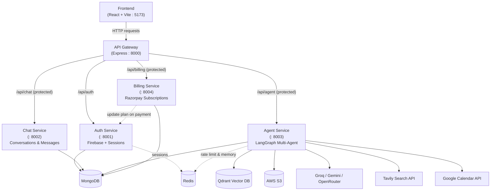
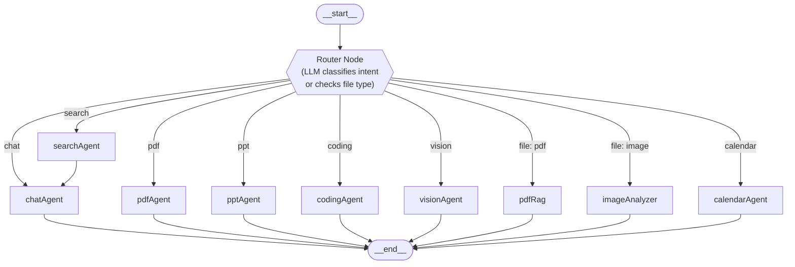

# 🦾 FridayAI — Multi-Agent AI Platform

**MERN + Microservices + LangGraph + RAG + Docker**

FridayAI ek production-style **multi-agent AI SaaS platform** hai — JARVIS/Friday jaisa personal AI assistant jo sirf chat nahi karta, balki alag-alag "specialist agents" ke through actual kaam karta hai: web search, coding help, PDF/PPT generate karna, PDF ke upar RAG-based Q&A, image analysis, aur Google Calendar manage karna. Poora backend **microservices architecture** me bana hai (Auth, Chat, Agent, Billing — sab alag services), jinke aage ek **API Gateway** baithta hai.

> Ye README repo analyse karke banaya gaya hai — architecture, folder structure, env variables aur setup steps sab actual code se match karte hain, taaki koi bhi is project ko clone karke aasani se run kar sake.

---

## 📌 Table of Contents

- [Kya Features Hain](#-kya-features-hain)
- [Tech Stack](#-tech-stack)
- [System Architecture](#-system-architecture)
- [Agent Service — LangGraph Flow](#-agent-service--langgraph-flow)
- [Folder Structure](#-folder-structure)
- [Prerequisites](#-prerequisites)
- [Setup & Installation](#-setup--installation)
- [Environment Variables](#-environment-variables)
- [Running the Project](#-running-the-project)
- [API Reference](#-api-reference)
- [Billing Plans](#-billing-plans)
- [Agent Rate Limits](#-agent-rate-limits)
- [Google Calendar OAuth Setup](#-google-calendar-oauth-setup)
- [Contributing](#-contributing)
- [License](#-license)
- [Author](#-author)

---

## ✨ Kya Features Hain

- 🔐 **Firebase Authentication** — Google/email login, session Redis me store hoti hai (7 din validity)
- 💬 **Multi-agent chat system** — ek hi chat box se 9 alag specialized agents kaam karte hain
- 🧠 **LangGraph-based Router Agent** — LLM khud decide karta hai ki query kis agent ke paas jaani chahiye
- 🔎 **Web Search Agent** (Tavily) — real-time internet search results ke saath answer
- 💻 **Coding Agent** — code likhna, debug karna, explain karna
- 📄 **PDF Agent** — PDF generate karna (pdfkit)
- 📊 **PPT Agent** — PowerPoint slides generate karna (pptxgenjs)
- 🖼️ **Vision Agent** — image generation / understanding (Gemini)
- 📚 **PDF RAG Agent** — apni PDF upload karke usi PDF ke upar Q&A (Qdrant vector DB + embeddings)
- 🔍 **Image Analyzer Agent** — uploaded image ko analyze karna
- 📅 **Calendar Agent** — Google Calendar se events add/update/delete/list karna (OAuth2 based)
- 💳 **Razorpay Billing** — Free / Starter / Growth subscription plans, credit-based usage
- ⚡ **Redis-based rate limiting** — per-agent per-minute request limits
- ☁️ **AWS S3** — uploaded files aur generated artifacts (PDF/PPT/images) store karne ke liye
- 🐳 **Dockerized Redis** — docker-compose se ek command me Redis up ho jaata hai
- 🌐 **API Gateway pattern** — single entry point, sab services isi se proxy hoti hain

---

## 🛠 Tech Stack

| Layer | Technology |
|---|---|
| **Frontend** | React 19, Vite, Redux Toolkit, TailwindCSS 4, Firebase (client SDK), Monaco Editor, Framer Motion (`motion`) |
| **Gateway** | Express 5, `express-http-proxy` |
| **Auth Service** | Express, Firebase Admin SDK, MongoDB (Mongoose), Redis |
| **Chat Service** | Express, MongoDB (Mongoose) |
| **Agent Service** | Express, **LangGraph** (`@langchain/langgraph`), LangChain core, Groq, Google Gemini, OpenRouter, Tavily, Qdrant (vector DB), AWS S3, Multer, pdf-parse, pdfkit, pptxgenjs, Google APIs (Calendar) |
| **Billing Service** | Express, MongoDB (Mongoose), Razorpay |
| **Shared** | Redis (ioredis) — sessions, rate limiting |
| **Infra** | Docker / docker-compose (Redis container) |

---

## 🏗 System Architecture

Poore system me ek **API Gateway (port 8000)** hai jo Frontend se aane wali har request ko authenticate karke (JWT/session middleware) sahi microservice ko forward karta hai. Har microservice apna alag MongoDB collection aur apna alag port use karti hai — is se services independently scale/deploy ho sakti hain.



> **Auth flow**: `GET /api/auth/me` gateway-level middleware (`auth.middleware.js`) se protect hota hai; baaki `/api/auth/*` routes seedha Auth service ko proxy hote hain. `/api/chat`, `/api/agent`, `/api/billing` — teeno protected hain aur `x-user-id` header ke saath internal service tak forward hote hain (`proxyWithHeader.js`).

---

## 🧠 Agent Service — LangGraph Flow

Agent service ka core `services/agent/graph/graph.js` me define hai — ye ek **LangGraph `StateGraph`** hai jisme ek **router node** hota hai, jo query (ya uploaded file ka type) dekh kar decide karta hai ki kaunsa specialist node call karna hai.

**Routing logic** (`graph/router.js`):
1. Agar frontend se explicitly `agent` field bheji gayi ho (auto nahi), to seedha wahi agent use hota hai.
2. Agar file upload hui ho → PDF hai to seedha `pdfRag` agent, image hai to seedha `imageAnalyzer` agent (LLM call skip ho jaata hai).
3. Warna ek chhota LLM call (`getLLMModel("router")`) prompt ke intent ko in categories me classify karta hai: `chat / search / pdf / ppt / coding / vision / calendar`.



Note karo — `searchAgent` seedha khatam nahi hota, uska result phir `chatAgent` ko pass hota hai jo Tavily se aaye raw search results ko ek natural, conversational answer me convert karta hai. Baaki sab agents seedha `__end__` par khatam ho jaate hain.

Har agent ka shared **state** (`graph/state.js`) ye fields carry karta hai: `prompt`, `aiResponse`, `agent`, `conversationId`, `searchResults`, `images`, `artifacts`, `userId`, `file` — is se ek node dusre node ko context pass kar paata hai.

*(Upar chat me isi flow ka ek interactive visual diagram bhi diya gaya hai.)*

---

## 📁 Folder Structure

```
FridayAI-Multi-Agent-AI-Platform-/
├── Backend/
│   ├── docker-compose.yaml        # Redis container
│   ├── package.json
│   ├── gateway/                   # API Gateway (port 8000)
│   │   ├── controller/user.controller.js
│   │   ├── middleware/auth.middleware.js
│   │   ├── utils/proxyWithHeader.js
│   │   └── index.js
│   ├── services/
│   │   ├── auth/                  # Auth service (port 8001)
│   │   │   ├── config/ (db.js, firebase.js)
│   │   │   ├── controllers/auth.controller.js
│   │   │   ├── models/user.models.js
│   │   │   ├── routes/auth.routes.js
│   │   │   └── serviceAccountKey.json  (⚠️ apna generate karna hoga, gitignored)
│   │   ├── chat/                  # Chat service (port 8002)
│   │   │   ├── config/db.js
│   │   │   ├── controller/chat.controller.js
│   │   │   ├── models/ (conversation.models.js, message.models.js)
│   │   │   └── route/chat.routes.js
│   │   ├── agent/                 # Agent service (port 8003) — LangGraph brain
│   │   │   ├── config/ (db, embedding, llmModel, memory, multer, s3, tavily, vectorDB, agentLimit)
│   │   │   ├── controllers/agent.controller.js
│   │   │   ├── graph/
│   │   │   │   ├── graph.js       # StateGraph definition
│   │   │   │   ├── router.js      # routing logic
│   │   │   │   ├── state.js       # shared agent state
│   │   │   │   └── agents/        # chat, search, pdf, ppt, coding, vision, pdfRag, imageAnalyzer, calendar
│   │   │   ├── models/user.models.js
│   │   │   ├── routes/ (agent.routes.js, GoogleCalendar.routes.js)
│   │   │   ├── service/Calendar.service.js
│   │   │   └── utils/ (deductCredits, generatePdf, generatePpt, getFromS3, uploadToS3, getMessages)
│   │   └── billing/                # Billing service (port 8004)
│   │       ├── config/ (db.js, plan.js, razorpay.js)
│   │       ├── controllers/billing.controller.js
│   │       ├── models/payment.models.js
│   │       └── routes/billing.routes.js
│   └── shared/
│       └── redis/redis.js
└── Frontend/
    ├── src/
    │   ├── components/ (ChatArea, ChatInput, MessageBubble, Sidebar, BillingPlan, CalendarConnectButton, Artifact, ...)
    │   ├── features/   (API calls — createConversation, sendMessage, verifyPayment, calendar, ...)
    │   ├── redux/slices/ (conversationSlice, messageSlice, userSlice)
    │   ├── pages/Home.jsx
    │   └── main.jsx / App.jsx
    ├── utils/ (axios.js, firebase.js)
    └── vite.config.js
```

---

## ✅ Prerequisites

Local machine par ye sab installed/available hone chahiye:

- **Node.js** v18+ aur npm
- **Docker & Docker Compose** (Redis ke liye)
- **MongoDB** — local instance ya MongoDB Atlas cluster
- Accounts/API keys in services ke:
  - Firebase (Auth + Admin SDK)
  - Groq, Google AI Studio (Gemini), OpenRouter (koi bhi ek/sab LLM providers)
  - Tavily (search)
  - Qdrant Cloud (ya self-hosted)
  - AWS S3 bucket
  - Google Cloud Console (Calendar OAuth client)
  - Razorpay (test mode keys)

---

## 🚀 Setup & Installation

```bash
# 1. Repo clone karo
git clone https://github.com/Raj-kumar18/FridayAI-Multi-Agent-AI-Platform-.git
cd FridayAI-Multi-Agent-AI-Platform-

# 2. Redis start karo (Docker se)
cd Backend
docker-compose up -d

# 3. Gateway dependencies install karo
cd gateway
npm install
cp .env.example .env    # phir .env me apni values bharo
cd ..

# 4. Har microservice ke liye dependencies install karo
cd services/auth      && npm install && cp .env.example .env && cd ../..
cd services/chat       && npm install && cp .env.example .env && cd ../..
cd services/agent      && npm install && cp .env.example .env && cd ../..
cd services/billing    && npm install && cp .env.example .env && cd ../..

# 5. Frontend dependencies install karo
cd ../Frontend
npm install
cp .env.example .env    # phir .env me apni values bharo
```

> 💡 Is README ke saath diye gaye `.env.example` files ko seedha unke respective folders me copy karke rename kar do (`.env`), phir apni actual keys bhar do — isse naya contributor 2 minute me setup kar sakta hai.

> ⚠️ Auth service ko chalane se pehle Firebase Console se `serviceAccountKey.json` generate karke `Backend/services/auth/` folder me daalna zaroori hai (Firebase Admin SDK isi file se init hota hai).

---

## 🔑 Environment Variables

Neeche har service ke liye exact `.env` variables diye gaye hain (README ke saath alag `.env.example` files bhi provide ki gayi hain, jo aap seedha copy karke use kar sakte ho).

### `Backend/gateway/.env`

```dotenv
PORT=8000

AUTH_SERVICE=http://localhost:8001
CHAT_SERVICE=http://localhost:8002
AGENT_SERVICE=http://localhost:8003
BILLING_SERVICE=http://localhost:8004

FRONTEND_URL=http://localhost:5173
REDIS_URL=redis://localhost:6379
```

### `Backend/services/agent/.env`

```dotenv
PORT=8003
MONGO_URI=
GROQ_API_KEY=
GOOGLE_API_KEY=
TAVILY_API_KEY=
CHAT_SERVICE_URL=http://localhost:8002
AUTH_SERVICE_URL=http://localhost:8001
REDIS_URL=redis://localhost:6379
OPENROUTER_API_KEY=
AWS_REGION=
AWS_ACCESS_KEY_ID=
AWS_SECRET_ACCESS_KEY=
AWS_BUCKET_NAME=

QDRANT_API_KEY=
QDRANT_URL=
QDRANT_COLLECTION_NAME="fridayAI"

GOOGLE_CLIENT_ID=
GOOGLE_CLIENT_SECRET=
GOOGLE_REDIRECT_URI=http://localhost:8003/api/calendar/oauth/callback
FRONTEND_URL=http://localhost:5173
```

### `Backend/services/auth/.env`

```dotenv
PORT=8001
MONGO_URI=
REDIS_URL=redis://localhost:6379
```

### `Backend/services/billing/.env`

```dotenv
PORT=8004
MONGO_URI=
RAZORPAY_KEY_ID=
RAZORPAY_KEY_SECRET=
AUTH_SERVICE=http://localhost:8001
```

### `Backend/services/chat/.env`

```dotenv
PORT=8002
MONGO_URI=
```

### `Frontend/.env`

```dotenv
VITE_FIREBASE_API_KEY=
VITE_SERVER_URL=
VITE_RAZORPAY_KEY=
```

| Variable | Kahan use hoti hai |
|---|---|
| `MONGO_URI` | Har service ka apna MongoDB connection string (alag database bhi ho sakti hai) |
| `REDIS_URL` | Sessions (Auth) + rate limiting & short-term memory (Agent) |
| `GROQ_API_KEY` / `GOOGLE_API_KEY` / `OPENROUTER_API_KEY` | LLM providers — router aur agents in models ko call karte hain |
| `TAVILY_API_KEY` | Search agent ke real-time web results ke liye |
| `QDRANT_URL` / `QDRANT_API_KEY` | PDF RAG agent ke embeddings vector store |
| `AWS_*` | Uploaded files + generated PDF/PPT/images S3 me store hote hain |
| `GOOGLE_CLIENT_ID/SECRET/REDIRECT_URI` | Calendar agent ka Google OAuth2 flow |
| `RAZORPAY_KEY_ID/SECRET` | Billing service payment orders + verification |
| `VITE_SERVER_URL` | Frontend se Gateway ka URL (e.g. `http://localhost:8000`) |

---

## ▶️ Running the Project

Redis pehle se `docker-compose up -d` se chal rahi honi chahiye. Har service alag terminal me chalao:

```bash
# Terminal 1 — Redis (agar already nahi chala hai)
cd Backend && docker-compose up -d

# Terminal 2 — Auth service
cd Backend/services/auth && npm run dev

# Terminal 3 — Chat service
cd Backend/services/chat && npm run dev

# Terminal 4 — Agent service (LangGraph brain)
cd Backend/services/agent && npm run dev

# Terminal 5 — Billing service
cd Backend/services/billing && npm run dev

# Terminal 6 — API Gateway
cd Backend/gateway && npm run dev

# Terminal 7 — Frontend
cd Frontend && npm run dev
```

Sab up hone ke baad:
- Frontend → `http://localhost:5173`
- Gateway (single entry point) → `http://localhost:8000`

---

## 📡 API Reference

Sab requests Frontend se **Gateway (`:8000`)** ke through jaati hain.

### Auth — `/api/auth` *(gateway → :8001)*

| Method | Endpoint | Description |
|---|---|---|
| `GET` | `/api/auth/me` | Current logged-in user info (protected) |
| `POST` | `/api/auth/login` | Firebase ID token verify karke session banana |
| `GET` | `/api/auth/logout` | Session end karna |
| `POST` | `/api/auth/update-plan` | Billing plan update (billing service isko internally call karti hai) |
| `POST` | `/api/auth/deduct-credits` | User ke credits deduct karna (agent use hone par) |

### Chat — `/api/chat` *(protected, gateway → :8002)*

| Method | Endpoint | Description |
|---|---|---|
| `GET` | `/createConversation` | Nayi conversation create karna |
| `GET` | `/getConversation` | User ki saari conversations list |
| `GET` | `/getConversationById/:id` | Ek specific conversation fetch |
| `PUT` | `/updateConversation/:id` | Conversation title/details update |
| `DELETE` | `/deleteConversation/:id` | Conversation delete |
| `POST` | `/saveMessage` | Message (user/assistant) save karna |
| `GET` | `/getMessage/:conversationId` | Conversation ke saare messages fetch |

### Agent — `/api/agent` *(protected, gateway → :8003)*

| Method | Endpoint | Description |
|---|---|---|
| `POST` | `/chat` | Main entry point — prompt (+ optional file) LangGraph ko bhejta hai, jo sahi agent choose karke response deta hai |

**Calendar sub-routes** (`/api/calendar` → agent service):

| Method | Endpoint | Description |
|---|---|---|
| `GET` | `/google/connect` | User ko Google consent screen pe redirect karta hai |
| `GET` | `/google/callback` | Google se OAuth code aata hai, tokens exchange hote hain |
| `GET` | `/google/status` | Frontend check karta hai calendar connected hai ya nahi |
| `POST` | `/google/disconnect` | Google Calendar connection remove karna |

### Billing — `/api/billing` *(protected, gateway → :8004)*

| Method | Endpoint | Description |
|---|---|---|
| `POST` | `/create-order` | Razorpay order create karna (plan select karne par) |
| `POST` | `/verify-payment` | Payment signature verify + Auth service me plan update trigger |

---

## 💳 Billing Plans

`services/billing/config/plan.js` me define hain:

| Plan | Price | Credits | Validity |
|---|---|---|---|
| `free` | ₹0 | 100 credits | 30 days |
| `starter` | ₹199 | 500 credits | 30 days |
| `growth` | ₹499 | 1000 credits | 30 days |

---

## ⏱ Agent Rate Limits

Redis-based per-user, per-agent, per-minute limits (`config/agentLimit.js`):

| Agent | Requests / minute |
|---|---|
| Chat | 20 |
| Search | 5 |
| Coding | 5 |
| PDF | 5 |
| PPT | 5 |
| Vision | 5 |

---

## 📅 Google Calendar OAuth Setup

1. Google Cloud Console me ek OAuth 2.0 Client ID banao.
2. **Authorized redirect URI** me *exactly* wahi URL daalo jo `.env` ke `GOOGLE_REDIRECT_URI` me hai — mismatch hone par `redirect_uri_mismatch` error aayega.
3. Scopes: `https://www.googleapis.com/auth/calendar` aur `.../calendar.events`.
4. Frontend ka "Connect Calendar" button `GET /api/calendar/google/connect` ko hit karega, jo user ko Google consent screen pe le jaata hai, aur callback ke baad refresh/access token user ke MongoDB record me save ho jaate hain.

---

## 🤝 Contributing

1. Repo fork karo
2. Feature branch banao (`git checkout -b feature/kuch-naya`)
3. Changes commit karo (`git commit -m "feat: kuch naya add kiya"`)
4. Branch push karo (`git push origin feature/kuch-naya`)
5. Pull Request kholo

---

## 📄 License

Is repo me abhi koi explicit `LICENSE` file nahi hai — agar aap ise open-source project banana chahte ho to MIT License add karne ka suggestion hai.

---

## 👤 Author

**Raj Kumar** ([@Raj-kumar18](https://github.com/Raj-kumar18))
Full-stack developer (MERN, Django, Python, TypeScript) — Founder, Pigeons Automation

---

⭐ Agar ye project pasand aaya to repo ko star karna mat bhoolna!
